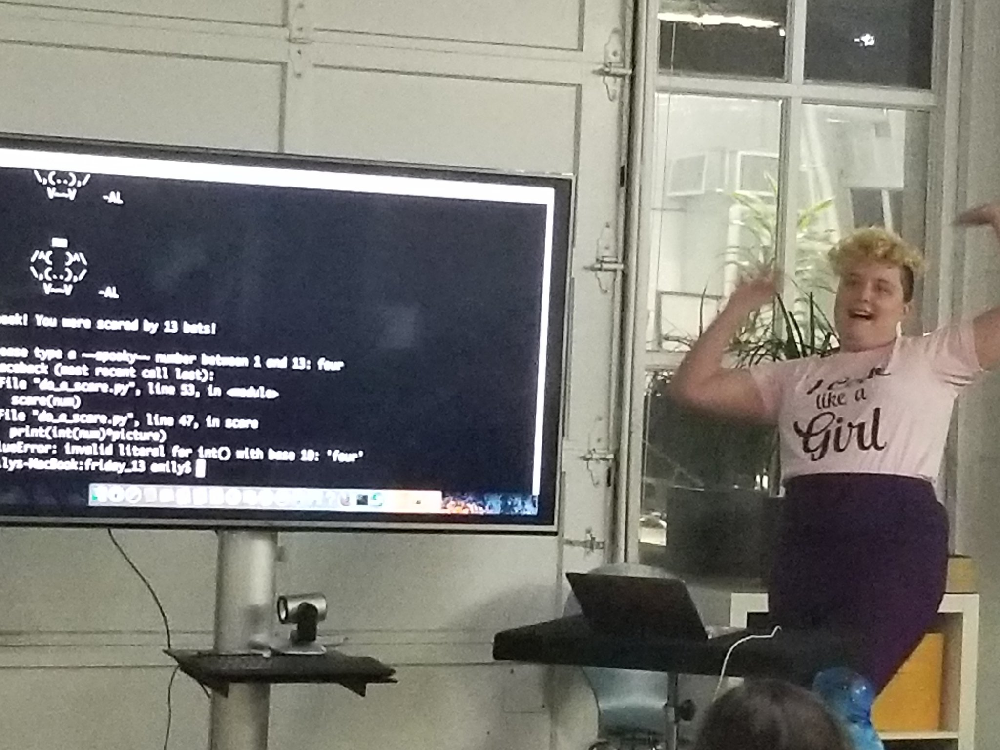
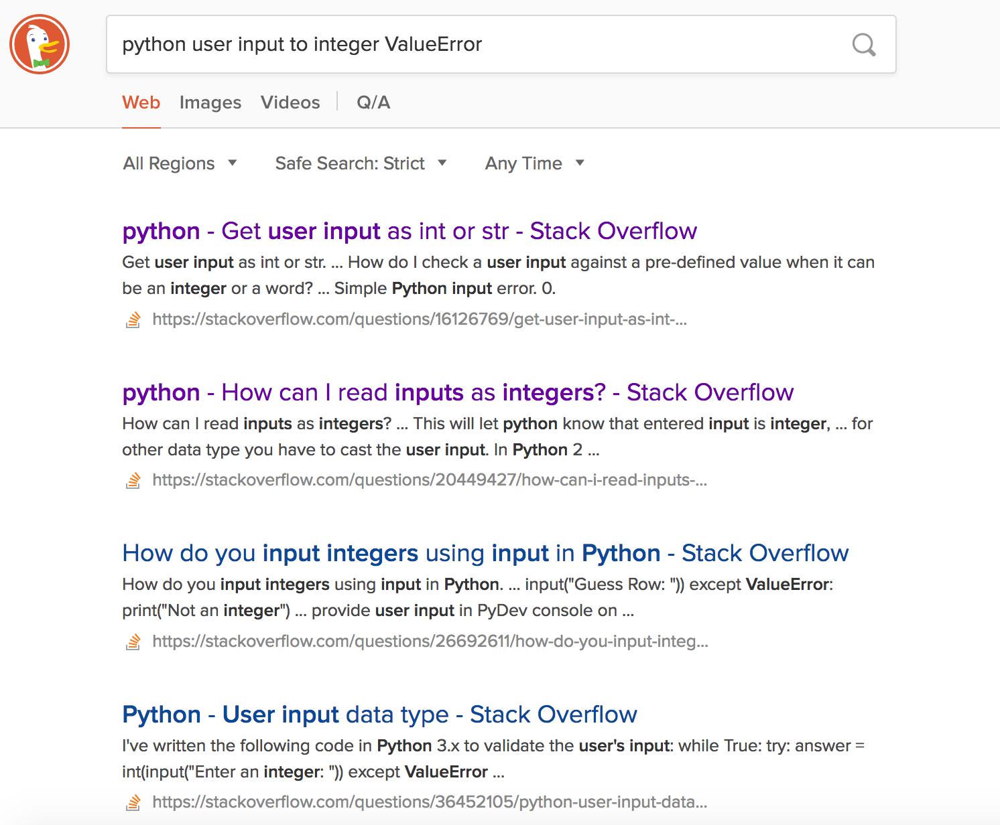

# SPOOKTACULAR ERROR MESSAGES
## Errors don't have to be scary!

This is adapted for a presentation I gave for [Django Girls PDX](https://twitter.com/DjangoGirlsPDX) on Friday, October 13, 2017. Feel free to adapt and use it in your own presentations; please give credit to me as EMCain on Github or @data_bae on Twitter.

The goal is to introduce beginners to the idea that error messages are just another form of information you can use, not a sign that you did something wrong.

You'll need to have Python and Git installed on your machine if you want to follow along at home. The sections that look like
```sh
$ some command
```
mean you should run everything after the `$` in a Linux-style shell, like Terminal, iTerm, or Git Bash. If you see text that's not after a `$`, that means you should expect to see similar text appear in your shell after you run the command.

## A Spooky Program

Try running the Python script in this repository.

To run it, clone the repository:

```sh
$ git clone git@github.com:EMCain/friday_13.git
```

Then navigate into the folder and run the script:

```sh
$ cd friday_13
$ python3 do_a_scare.py
```
> Note: if you only have Python 3 on your machine, the command might just be 'python'.

You should see something like this:

```
Happy Friday the 13th!

Please type a ~~spooky~~ number between 1 and 13:
```

Try entering a number, then hit `enter` or `return`.

```
Please type a ~~spooky~~ number between 1 and 13: 4

 .-.
(o o) boo!
| O \
 \   \
  `~~~'

 .-.
(o o) boo!
| O \
 \   \
  `~~~'

 .-.
(o o) boo!
| O \
 \   \
  `~~~'

 .-.
(o o) boo!
| O \
 \   \
  `~~~'

boo! You were scared by 4 ghosts!

```

Try again to see different spooky creatures:

```
Please type a ~~spooky~~ number between 1 and 13: 5


         mm
      /^(  )^\
      \,(..),/
        V~~V    -AL


         mm
      /^(  )^\
      \,(..),/
        V~~V    -AL


         mm
      /^(  )^\
      \,(..),/
        V~~V    -AL


         mm
      /^(  )^\
      \,(..),/
        V~~V    -AL


         mm
      /^(  )^\
      \,(..),/
        V~~V    -AL

eeeek! You were scared by 5 bats!

Please type a ~~spooky~~ number between 1 and 13: 2

                         .-.
                          \ \
                           \ \
                            | |
                            | |
          /\---/\   _,---._ | |
         /^   ^  \,'       `. ;
        ( O   O   )           ;
         `.=o=__,'            \
           /         _,--.__   \
          /  _ )   ,'   `-. `-. \
         / ,' /  ,'        \ \ \ \
        / /  / ,'          (,_)(,_)
       (,;  (,,)      jrei

                         .-.
                          \ \
                           \ \
                            | |
                            | |
          /\---/\   _,---._ | |
         /^   ^  \,'       `. ;
        ( O   O   )           ;
         `.=o=__,'            \
           /         _,--.__   \
          /  _ )   ,'   `-. `-. \
         / ,' /  ,'        \ \ \ \
        / /  / ,'          (,_)(,_)
       (,;  (,,)      jrei

hissssssss! You were scared by 2 black cats!
```
Pretty spooky, right?

But if you want to see something **even scarier**, try entering something that's not a number:

```
Please type a ~~spooky~~ number between 1 and 13: oh no, how scary!
```

...are you ready for this???

```
Please type a ~~spooky~~ number between 1 and 13: oh no, how scary!
Traceback (most recent call last):
  File "do_a_scare.py", line 53, in <module>
    scare(num)
  File "do_a_scare.py", line 47, in scare
    print(int(num)*picture)
ValueError: invalid literal for int() with base 10: 'oh no, how scary!'
Emilys-MacBook:friday_13 emily$
```
**AAAAAAAAAAAAA**

**THERE'S AN ERROR**

**EVERYTHING IS BROKEN**

**NOOOOOOOOOOO**


ok

*takes a deep breath*

## Errors don't have to be scary

From our day-to-day usage of computers, we've learned that seeing an error message means something has gone wrong, and probably that we did something wrong.

However, when you're writing a program, it helps to see error messages differently. It's normal to see a lot of them when you're programming. And if you learn to read them, they can be valuable sources of information.

Let's look at that error message we just saw. What does it mean?

```
Traceback (most recent call last):
  File "do_a_scare.py", line 53, in <module>
    scare(num)
  File "do_a_scare.py", line 47, in scare
    print(int(num)*picture)
ValueError: invalid literal for int() with base 10: 'oh no, how scary!'
```

It starts with this line:

```
Traceback (most recent call last):
```

Hey, that's helpful. It looks like the most recent thing that went wrong is going to be at the end.

```
File "do_a_scare.py", line 47, in scare
  print(int(num)*picture)
ValueError: invalid literal for int() with base 10: 'oh no, how scary!'
```

What's going on here?

Well, we entered 'oh no, how scary!' instead of a number. And now we see that it's showing up in our error message at the end.

```
ValueError: invalid literal for int() with base 10: 'oh no, how scary!'
```

We'll worry about what the rest of this means in a minute.

Let's look at the line immediately before the error message. This is the line of code that caused the error to happen.

```
File "do_a_scare.py", line 47, in scare
  print(int(num)*picture)
```

Take a look at the script file we just ran, `do_a_scare.py`. Sure enough, we see the code above at line 47, in a function called `scare`.

```python
def scare(num):
    """pass in an integer (whole number)"""

    name, picture, sound = random.choice(ANIMALS)
    # print picture num times (after converting num to an integer)
    print(int(num)*picture)
    print(sound + '! You were scared by ' + num + ' ' + name + 's!' )
```

Fortunately, there's a comment above line 47 explaining what it is doing. (Any text after a `#` symbol will not be read by the Python interpreter; it is a comment for humans to read.)

```python
    # print picture num times (after converting num to an integer)
    print(int(num)*picture)
```

Let's see if we can find anything in our error message to explain what went wrong with this line.

```
ValueError: invalid literal for int() with base 10: 'oh no, how scary!'
```

The error message seems to be complaining about how the `int()` function is being used, and our line of code has `int(num)` in it.

It looks like somehow, that text we typed into the prompt -- `'oh no, how scary!'` -- was being used as the variable `num`, and passed into the function called `int`. This worked fine when `num` was a number, like `4` or `12`, but trying to convert text to an integer (whole number) caused a `ValueError`.

How did the text we typed get passed to the function `scare`? Let's look at the error traceback again. Here's the traceback line above the one we just looked at.

```
File "do_a_scare.py", line 53, in <module>
  scare(num)
```

What this means is that the last line of the traceback, line 47, was called because of a line in the program calling the `scare` function with `num` as the input. This function call was also in the `do_a_scare.py` file, on line 53.

For a more complicated program, you might see a much longer traceback. You can work your way back through the traceback to find out what went wrong in your program.

## Searching for Help

If you see an error when programming, it can be hard to know where to start solving it. Here's a formula I like to use when coming up with a search query to use in my favorite search engine.

* name of program or framework
* a few words about what I'm trying to do
* the error message I'm seeing (if any)

Here, I'm using Python. I'm trying to take the user's input and transform it into an integer value. And I'm getting a ValueError. So in this case, I would type

```
python user input to integer ValueError
```

Let's see what I get:



It looks like a lot of people have asked similar questions! You can look at what they've done in order to get an idea of what to do next.

## Conclusion

This is just an introduction to how you'll read error messages as a programmer. They don't have to be scary!

As you continue your programming journey, you'll see a lot of error messages. Try not to worry, and see what you can learn from them.
